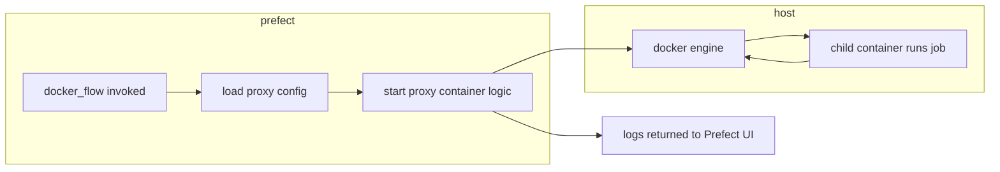

# Thin Docker Container Proxy for Prefect

A lightweight, configurable proxy for launching Dockerized workloads from within a Prefect flow.
It acts as a generic “execution wrapper” around arbitrary containerized jobs such as ETL tasks, analytics, one-shots,
or JVM micro-jobs.

The [proxy.py](./src/prefect_custom_docker/proxy.py) is intentionally minimal and delegates all real work to the child
container, passing along configuration, environment variables, commands, and volume mounts defined in Prefect deployment
settings.

## Core Idea

1. __One__ Dockerized Prefect flow which act as a proxy. 
2. Actual flow configurations are declared as child Docker containers using yaml syntax.
3. Polyglot setup - Prefect spins up flows which are implemented outside of Python ecosystem (e.g. JVM-based stacks)

See [examples](./examples) for details.



Instead of creating a new Prefect flow per job type, a single “docker proxy” flow accepts configuration at
runtime (via Prefect job variables) and spins up the corresponding child container.

The proxy’s responsibilities are:

* read configuration from environment
* spin up a child container using the Docker Engine
* pipe logs back into Prefect
* exit with the child container’s status

All real computation happens inside the child container.

## Configuration Conventions

| Variable  | Description                                                    |
|-----------|----------------------------------------------------------------|
| `IMAGE`   | Required. Docker image to run.                                 |
| `COMMAND` | Optional container command override.                           |
| `VOLUMES` | Optional list of Docker volumes (e.g. `["/host:/container"]`). |

### Dynamic Environment Mapping

Any Prefect job variable ending with the suffix `_ENV` will automatically be passed to the child container as an
environment variable.

Example `Prefect` _deployment_ variables:

```
env:
  IMAGE: "{{ prefect.variables.myproject.image" }}
  VOLUMES: "{{ prefect.variables.myproject.volumes" }}
  DB_NAME_ENV: "{{ prefect.variables.myproject_db_name }}"
  DB_USER_ENV: "{{ prefect.variables.myproject_db_user }}"
  DB_PWD_ENV: "{{ prefect.variables.myproject_db_pwd }}"
  DB_HOST_ENV: "{{ prefect.variables.myproject_db_host }}"
  DB_PORT_ENV: "{{ prefect.variables.myproject_db_port }}"
```

Inside the child container these become resolved as:

```
DB_NAME_ENV=analytics
DB_USER_ENV=user
DB_PWD_ENV=s3cr3t
DB_HOST_ENV=db.remote.instance
DB_PORT_ENV=5432
```

### Prefect Deployment Requirements

Because the proxy itself launches a secondary container, the Prefect worker running this flow must have access to the
Docker Engine.

__Required__: mount Docker socket when deploying the flow.

```
volumes:
  - /var/run/docker.sock:/var/run/docker.sock
```

### Log Propagation

All logs emitted by the child container are captured, decoded, and printed into the Prefect task logs so that:

* Prefect UI shows full container output
* Errors and tracebacks appear naturally in the flow logs
* No separate logging setup is required

## How To Build
In order to build the Dockerized proxy, modify the provided [Makefile](./Makefile) and specify your Docker registry. 

Then build the docker image and optionally push it to the registry.

```
make build && make docker_push
```